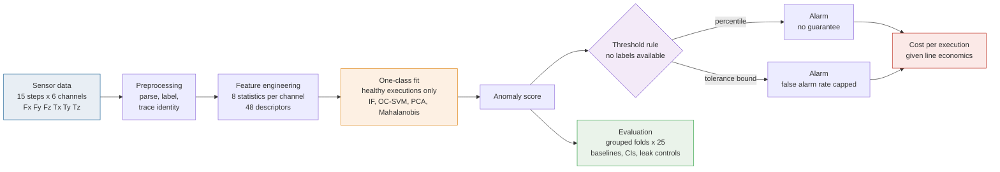
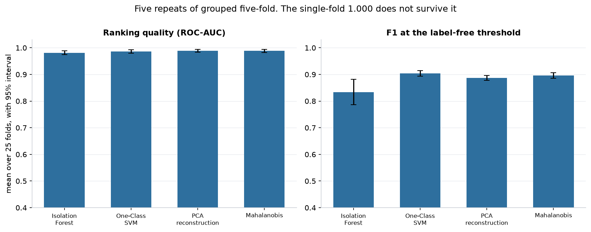
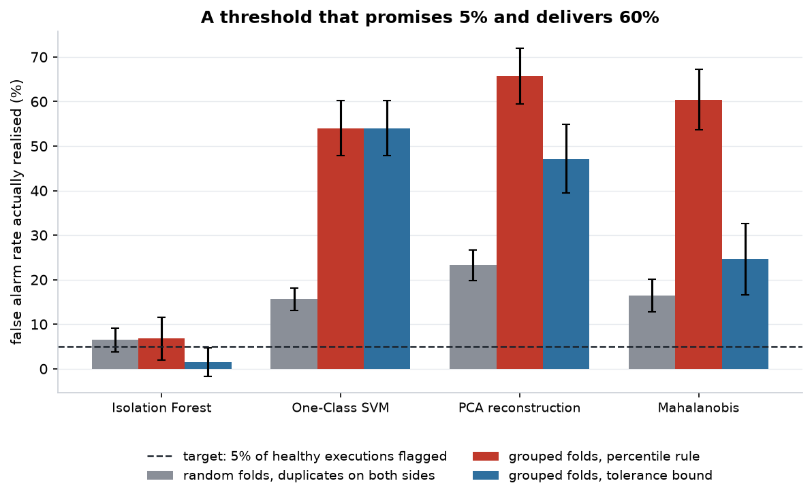
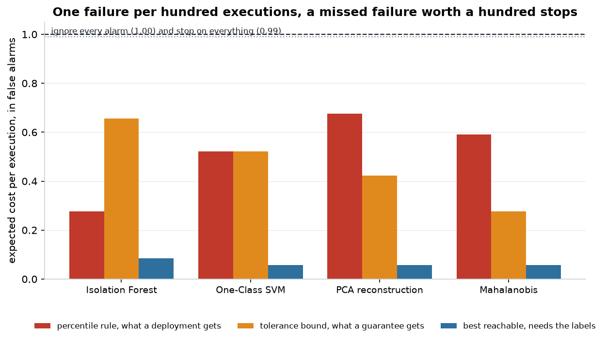
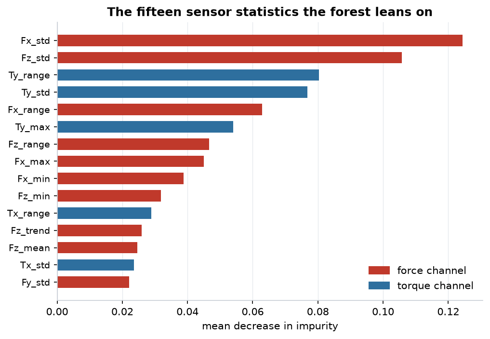
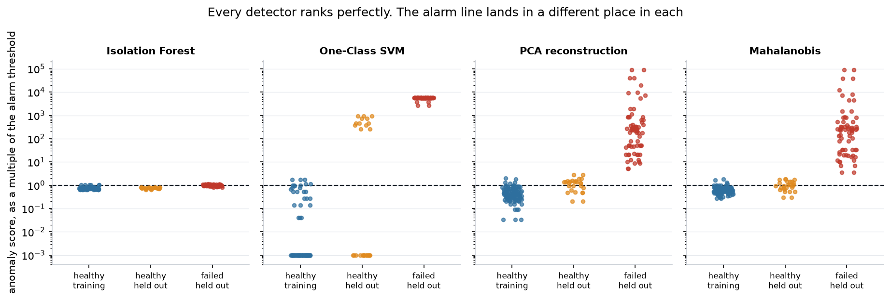

<div align="center">

# Robot Anomaly Detection

**An anomaly detection framework for robotic and industrial systems, and an evaluation protocol that shows what the usual one hides.**

Four one-class detectors fitted on healthy operation alone, on 463 executions of
an industrial manipulator recorded through six force and torque channels.
Every figure carries a confidence interval, every leak is measured rather than
asserted, and continuous integration fails if any number on this page moves.


[](https://github.com/Ilyess911/robot-anomaly-detection/actions/workflows/verify.yml)


</div>

---

## Three findings, in sixty seconds

> **1. The benchmark is 46% duplicates, and that is where the perfect scores came from.**
> 463 rows hold 251 distinct sensor traces. A random split hands the model 64 of
> its 93 test executions in advance. Under grouped folds, a random forest's
> `1.000 ± 0.000` becomes `0.979 ± 0.019`.
>
> **2. The detectors rank almost perfectly and calibrate catastrophically.**
> ROC-AUC 0.981 to 0.989 over 25 grouped folds. Yet a threshold asking for a 5%
> false alarm rate delivers **54% to 66%** on healthy executions it has not seen.
> Grouping the folds *triples* that figure: the duplicates were hiding the
> calibration failure too.
>
> **3. On a realistic line, that miscalibration destroys 90% of the value.**
> At one failure per hundred executions with a missed failure worth a hundred
> stops, the reachable cost is 0.058 per execution. What a label-free threshold
> actually delivers is 0.52 to 0.68. The model is not the bottleneck. The
> threshold is.


<sub>A detector that has never seen a failure, scoring 93 executions it has never seen.
The ranking is clean. The alarm line is not where it should be, and that is the whole problem.</sub>

## Why this matters

A robot cell does not announce its faults. It produces a collision, an
obstruction or a lost part, and a wrist sensor records six numbers fifteen times
while it happens. Turning those numbers into a decision, stop the arm or let it
finish, is the elementary unit of industrial condition monitoring, and the same
shape of problem sits under predictive maintenance, equipment health monitoring
and most of what Industry 4.0 calls smart manufacturing.

Two things make it hard in practice, and neither is the classifier.

A new cell has months of healthy operation and no catalogue of the failures it
has not had yet, so the deployable model is a one-class detector, not a
supervised one. And a one-class detector has to place its alarm threshold
without ever seeing a labelled failure. This project measures what that second
constraint costs, in false alarms and then in money, because an operator stopped
three times a shift for nothing switches the detector off within a week, and
after that its recall is zero.

## Problem statement

> **How well can lightweight machine learning models detect abnormal operating
> behaviour in a robotic system from multivariate force and torque data, how
> much of a reported score survives an honest evaluation protocol, and what is
> left once the threshold has to be chosen without labels?**

## System overview



## The promise, and its limits

| It does | It does not |
| --- | --- |
| **Publish a baseline and a confidence interval next to every score** | Claim the models are good. Most of the performance is in the data |
| **Detect without labelled failures**, fitted on healthy runs alone | Run anywhere near a production line |
| **Measure three leaks rather than assert their absence** | Validate over time. Executions are shuffled, not ordered |
| **Price the alarm threshold in expected cost, not only in F1** | Generalise beyond one arm, one task, one recording session |
| **Reproduce every figure on this page by one command** | Solve the calibration problem it identifies |

## Methods

**Features.** Eight statistics per sensor channel: mean, standard deviation,
minimum, maximum, range, skewness, kurtosis and the slope of a linear fit over
the fifteen steps. Six channels gives 48 descriptors. Raw samples were rejected
because 90 values on 463 executions overfits and produces names no maintenance
engineer can argue with. `Tz_std` is the variability of yaw torque; feature 74 is
nothing.

**One-class detectors**, fitted on healthy executions only, chosen to span the
ways a detector can be cheap:

| Detector | Idea | Why it is here |
| --- | --- | --- |
| Isolation Forest | random partitioning isolates outliers in few splits | no distance, no distributional assumption |
| One-Class SVM | a kernel boundary around the healthy region | the standard non-parametric answer |
| PCA reconstruction | project onto the healthy subspace, rebuild, measure the residual | this is the linear autoencoder |
| Mahalanobis distance | distance to the healthy mean under a shrunk covariance | the classical control chart, the one to beat |

A nonlinear autoencoder is deliberately absent. There are about 103 healthy
executions in a training fold and 48 features; a network wide enough to be called
one would carry more parameters than it has samples, and its reconstruction error
would describe its initialisation rather than the robot. PCA reconstruction error
is the linear case of the same idea and it is honest at this sample size.

**Threshold rules**, because a score is not a decision:

| Rule | What it promises | How it works |
| --- | --- | --- |
| `percentile` | nothing | the 95th percentile of the healthy training scores |
| `tolerance` | false alarm rate below 5%, with 90% confidence | the k-th largest training score, k chosen from the exact Beta(k, n-k+1) law of the exceedance probability |

The second is a distribution-free one-sided tolerance bound. It assumes nothing
about the shape of the score distribution, which is the only assumption a
deployment can actually honour. Its cost is sensitivity, and that cost is
measured below rather than waved away.

**Supervised classifiers** are kept as an upper reference, not as the product:
logistic regression, random forest, RBF SVM and gradient boosting, grid-searched
under grouped cross-validation with the scaler inside the pipeline.

**Baselines**, published beside every score: answer "failure" every time, the
best single sensor statistic at a single threshold, and a depth-2 decision tree.

## Experimental setup

| | |
| --- | --- |
| Dataset | UCI Robot Execution Failures, LP1 to LP5, redistributed unmodified |
| Executions | 463, of which 129 healthy and 334 failed (72.0% failures) |
| Distinct sensor traces | **251**. The gap is finding 1 |
| Signal | 15 time steps by 6 channels, so 90 raw values per execution |
| Features | 48 statistical descriptors |
| Headline protocol | 5 repeats of grouped stratified 5-fold, so **25 fits per detector** |
| Grouping | by sensor trace, so no recording appears on both sides of a fold |
| Reported | mean over 25 folds with a t-based 95% confidence interval |
| Seed | 42 everywhere, set in `configs/default.toml` |
| Environment | Python 3.14.6, scikit-learn 1.9.0, numpy 2.5.1, pinned in `requirements-lock.txt` |

## Results

### The problem is easier than any model suggests

Measured on the grouped held-out fold. The first three rows are not models.

| | F1 failure | Accuracy | Precision | Recall |
| --- | --- | --- | --- | --- |
| Answer "failure" every time | 0.838 | 0.720 | 0.720 | 1.000 |
| **One sensor, one threshold** (`Fx_range`) | **0.931** | 0.903 | 0.953 | 0.910 |
| A depth-2 tree, so three decisions | 0.963 | 0.946 | 0.956 | 0.970 |

One threshold on one force channel covers 93% of the way. Any table that omits
these rows is misleading even when every figure in it is correct, and the
modelling contribution on this dataset is close to nil. What follows is about
the protocol, not the models.

### One-class detection, 25 grouped folds

| Detector | ROC-AUC | F1 at the label-free threshold | Recall | Inference | Size |
| --- | --- | --- | --- | --- | --- |
| Isolation Forest | 0.981 [0.974, 0.989] | 0.834 [0.786, 0.881] | 0.755 | 4.21 ms | 1396 kB |
| One-Class SVM | 0.986 [0.979, 0.993] | **0.904** [0.894, 0.914] | 0.995 | 0.09 ms | 15 kB |
| PCA reconstruction | 0.988 [0.983, 0.994] | 0.887 [0.878, 0.896] | 0.998 | 0.09 ms | **10 kB** |
| Mahalanobis | **0.989** [0.983, 0.995] | 0.896 [0.886, 0.907] | 1.000 | 0.14 ms | 39 kB |



Two readings a single fold would not have supported.

**Three of the four are statistically indistinguishable.** One-Class SVM,
Mahalanobis and PCA have overlapping intervals on every metric. Ranking them by
the third decimal would be reading noise. Isolation Forest is distinguishably
worse than the first two, and it is also **46 times slower and 145 times larger**
than the cheapest of them. On this data the classical control chart is not
beaten by anything, which is worth saying plainly.

**An earlier version of this page reported ROC-AUC 1.000 for all four.** That
was one held-out fold of 93 executions. It did not survive 25.

### The finding that matters: the threshold promises 5% and delivers 60%

Every detector above is thresholded by a rule asking for a 5% false alarm rate.
Here is what the rule actually produces on healthy executions it has never seen.

| Detector | Target | Realised, random folds | Realised, grouped folds | With the tolerance bound |
| --- | --- | --- | --- | --- |
| Isolation Forest | 5% | 6.5% | **6.8%** | 1.5% |
| One-Class SVM | 5% | 15.7% | **54.0%** | 54.0% |
| PCA reconstruction | 5% | 23.2% | **65.7%** | 47.2% |
| Mahalanobis | 5% | 16.4% | **60.4%** | 24.7% |



Three things fall out of this table.

**The rule fails even before grouping.** At 16% to 23% against a 5% target, the
percentile of 103 samples is a poor estimate of a tail quantile, and a tutorial
that stops at `np.percentile(scores, 95)` is shipping a promise it cannot keep.

**Grouping triples the failure.** The duplicates were not only inflating F1 by
two to four points; they were hiding a threefold miscalibration. Two copies of
the same recording on both sides of a split make the held-out healthy runs look
like the training healthy runs, which is exactly the assumption a threshold rule
depends on and exactly the one the data violates.

**Healthy operation is not one distribution.** That is the mechanism. The five
subsets are phases of the same assembly task, with different force regimes, so
"healthy" is a mixture. A threshold calibrated on a sample of that mixture does
not transfer to an unseen part of it. Neither rule here can fix that, because
both assume the healthy training and healthy held-out runs are drawn from the
same law. Saying so is the honest end of this analysis and the natural start of
the next one.

**The bound is not useless, though.** Where the score distribution is smooth, it
halves the damage: Mahalanobis falls from 60.4% to 24.7%. Where the score is
nearly discrete, it cannot help: One-Class SVM is unchanged at 54.0%, because its
decision function takes almost the same value for most healthy runs and no order
statistic separates them.

**And F1 hides all of it.** One-Class SVM scores 0.904 F1 while flagging 54% of
healthy executions, because this test set is 72% failures. On a line at 1%
failures that same detector is unusable. Which is why the next section stops
reporting F1.

### What it would cost on a line

Expected cost per execution, with the failure rate and the cost of a missed
failure treated as free parameters rather than invented. Reference case: one
failure per hundred executions, a missed failure worth a hundred unnecessary
stops.

| Detector | Best reachable | At the percentile rule | At the tolerance bound | Ignore every alarm | Stop on everything |
| --- | --- | --- | --- | --- | --- |
| Isolation Forest | 0.085 | 0.277 | 0.656 | 1.00 | 0.99 |
| One-Class SVM | **0.058** | 0.522 | 0.522 | 1.00 | 0.99 |
| PCA reconstruction | **0.058** | 0.675 | 0.422 | 1.00 | 0.99 |
| Mahalanobis | **0.058** | 0.591 | **0.276** | 1.00 | 0.99 |



The detector could take the cost from 1.00 to 0.058, a seventeenfold reduction.
The threshold a deployment can actually set delivers 0.28 to 0.68. **Between 80%
and 90% of the achievable benefit is lost to the choice of threshold, not to the
choice of model.** Switching Mahalanobis from the percentile rule to the
tolerance bound recovers more than half of that loss, which is the one concrete
improvement this repository can claim.

The full grid over five failure rates and seven cost ratios is in
`reports/deployment.json`. Every one of those numbers is an assumption about a
plant, stated as such, multiplied by a rate measured on held-out data.

### Why the scores looked perfect before: the duplicate leak

463 rows hold **251 distinct sensor traces**. LP2 and LP3 annotate the same 47
recordings under two different fault taxonomies; LP4 and LP5 share 116 more.
Under the random split that every published result on this dataset uses,
including this project's own earlier numbers, **64 of the 93 test executions have
an exact copy in the training half**.

| Cross-validated F1, supervised | Random folds | Grouped folds | Cost |
| --- | --- | --- | --- |
| Logistic Regression | 0.979 ± 0.012 | 0.947 ± 0.028 | **-0.032** |
| Random Forest | **1.000 ± 0.000** | 0.979 ± 0.019 | **-0.021** |
| SVM (RBF) | 0.977 ± 0.013 | 0.954 ± 0.032 | **-0.023** |
| Gradient Boosting | 0.994 ± 0.008 | 0.959 ± 0.012 | **-0.036** |


The standard deviation of exactly zero was the tell. A model does not reach
identical perfection on five different folds of 463 samples unless the folds are
not independent. Full evidence in
[`docs/data-quality-audit.md`](docs/data-quality-audit.md), together with an
earlier labelling defect in which one subset named its healthy class `ok` while
every other named it `normal`.

### Transfer to an unseen phase of the task

Hold out one phase, fit on the rest, and remove every copy of the held-out
traces. Mean ROC-AUC over the four detectors:

| Held out | Healthy runs left | Trace-disjoint | Duplicates left in |
| --- | --- | --- | --- |
| LP1 | 108 | 0.998 | 0.998 |
| LP2 | 69 | 0.952 | 0.990 |
| LP3 | 69 | 0.952 | 0.990 |
| LP4 | 81 | 0.991 | 0.998 |
| LP5 | 21 | **0.923** | 0.993 |


The naive protocol reports near-perfect transfer everywhere. The honest one does
not, and the hardest case leaves only 21 healthy executions to learn from. This
is the same mixture effect that breaks the threshold rule, seen from the other
side.

### Why one leak control was not enough

<details>
<summary>The shuffled-label control, the standardisation leak, and what each one actually tested</summary>

<br />

Refit on permuted labels and check the model collapses: real labels give 0.993
cross-validated F1, shuffled labels 0.760, below the constant baseline of 0.838.
A clean pipeline fits patterns that are not there and pays for it.

That control passed for a year while 46% of the dataset was duplicated
executions, and it was right to. A permutation destroys the association a
duplicate carries, so a sample leak collapses under it exactly like a clean
pipeline. **A leak control tests one leak.** Feature leakage, scaler leakage and
sample leakage are three different failures and each needs its own check. All
three now run on every commit.

The standardisation leak, measured in one environment with one set of seeds:

| | Leaky | Clean | Cost |
| --- | --- | --- | --- |
| Logistic Regression | 1.000 | 0.977 | **-0.023** |
| Random Forest | 1.000 | 1.000 | 0.000 |
| SVM (RBF) | 0.977 | 0.977 | 0.000 |
| Gradient Boosting | 0.993 | 0.993 | 0.000 |

Zero on the tree models, which are invariant to scaling and could never have been
affected. On logistic regression it buys a fake perfect score. An earlier version
of this page reported -0.011 for it by comparing notebook outputs from Python 3.9
against a script run on Python 3.14: two variables, one conclusion. Any leak
measurement is only meaningful inside one pinned environment.

</details>

### Signals


Failures are not separated by where the mean sits. They are separated by how much
the signal moves, which is why the forest leans on dispersion first:





<sub>Every score divided by its own detector's alarm threshold, alarm at 1.0 on each panel.
This is where the 54% false alarm rates come from: the healthy held-out runs sit above the line.</sub>

## Design decisions

**Statistical features instead of raw samples.** 90 raw values on 463 runs
invites overfitting and resists interpretation. Eight statistics per sensor
produce names a maintenance engineer can argue with.

**All five subsets merged, but grouped by trace.** LP1 to LP5 are phases of one
assembly task holding between 47 and 164 executions. Kept apart, three of the
five are too small to split. Merged naively, the duplicates leak. Merged with a
grouped split, both problems are answered.

**Binary target.** The 16 original labels include classes with 3 and 5 members. A
16-class model on 463 samples produces confident nonsense on the rare ones, and
the useful question on a line is binary anyway.

**One-class detectors see only healthy runs.** That mirrors deployment order.

**The oracle threshold is reported but never used as a result.** Reporting the F1
at the threshold that maximises F1 requires the labels and means nothing for
deployment. It appears only as the ceiling the label-free rules are measured
against.

**Costs are parameters, never assumptions folded into a score.** The detector's
discrimination is measured on held-out data; the line's economics are imposed
from outside and stated. The two are never mixed into one number without saying
so.

## Repository structure

```
src/
  data/          loader.py        parsing, label semantics, trace identity
  features/      statistical.py   48 descriptors from 90 raw readings
  models/        detectors.py     four one-class detectors, one contract
                 supervised.py    classifiers and their search grids
                 legacy.py        the notebooks' trainers, superseded
  evaluation/    metrics.py       named metrics, threshold analysis, controls
                 protocol.py      random and grouped splits, side by side
                 calibration.py   percentile rule and distribution-free bound
                 cost.py          expected cost under line economics
  visualization/ plots.py         exploratory figures
  config.py                       parameters, seeding, logging

scripts/  benchmark.py    baselines and supervised models, both protocols
          experiments.py  repeated grouped CV, calibration, transfer
          deployment.py   cost-sensitive operating point, inference cost
          figures.py      redraws every image on this page from reports/
          detect.py       inference CLI, scores a subset or a file
app/      streamlit_app.py   browser demo, move the threshold and watch
configs/  default.toml    every parameter that can move a published number
tests/    dataset, protocol, duplicates, detectors, calibration, cost
notebooks/ 01 to 05, the original course work, outputs deliberately unchanged
data/     lp1 to lp5, the UCI subsets, unmodified
reports/  benchmark.json, experiments.json, deployment.json
assets/   every figure on this page
docs/     the audit, the research pitch, the application summary
```

### The documentation kit

| File | What it holds |
| --- | --- |
| [`docs/data-quality-audit.md`](docs/data-quality-audit.md) | Both data defects, the evidence, and why the existing control missed one |
| [`docs/research_pitch.md`](docs/research_pitch.md) | Motivation, methods, results, limits, and a 9 to 12 week extension |
| [`docs/application_summary.md`](docs/application_summary.md) | The project at three lengths, plus the open research questions |
| [`docs/engineering-rules.md`](docs/engineering-rules.md) | Rules this repository does not negotiate |
| `reports/*.json` | The proof behind every number on this page |

## Quick start

```bash
git clone https://github.com/Ilyess911/robot-anomaly-detection.git
cd robot-anomaly-detection
make setup        # venv with the exact versions behind the published numbers
make verify       # lint, 43 tests, all three studies
make reproduce    # every number and every figure on this page, from scratch
```

## Example usage

Score one phase of the task with a detector that has never seen it, nor any of
its duplicated recordings:

```bash
python scripts/detect.py --subset LP1 --detector mahalanobis --top 5
```

```
 execution  anomaly_score  flagged  actual
        66     776261.248        1 failure
        60     628700.987        1 failure
        70     508568.792        1 failure
        83     366135.046        1 failure
        37     305859.507        1 failure

alarm threshold (p95 of healthy training scores): 35.708
flagged 87 of 88 executions
against the recorded labels: f1 0.870, precision 0.770, recall 1.000, roc-auc 1.000
```

In code, including the part this project argues is the hard one:

```python
from src.data.loader import encode_labels, load_robot_data, trace_ids
from src.features.statistical import create_statistical_features, feature_matrix
from src.evaluation.protocol import grouped_split
from src.evaluation.calibration import tolerance_threshold, realised_far
from src.models.detectors import MahalanobisDetector

frame, _ = encode_labels(load_robot_data(), binary=True)
X, _ = feature_matrix(create_statistical_features(frame))
y = frame["label_encoded"].to_numpy()

split = grouped_split(X, y, trace_ids(frame))
detector = MahalanobisDetector().fit(split.X_train[split.y_train == 0])

# A threshold that caps the false alarm rate at 5% with 90% confidence,
# assuming nothing about the shape of the score distribution.
rule = tolerance_threshold(detector.train_scores_, target_far=0.05, confidence=0.90)
scores = detector.anomaly_score(split.X_test)

print(rule.order_statistic, rule.guaranteed_far)        # which order statistic, what it promises
print(realised_far(rule, scores[split.y_test == 0]))    # what it delivered
```

Or in the browser:

```bash
pip install -r requirements-demo.txt
make demo
```

## Research perspective

**What this project establishes.** On this data, one-class detection is a solved
ranking problem and an unsolved calibration problem, and the second costs an
order of magnitude more than the first is worth. The mechanism is identified:
healthy operation is a mixture of regimes, so a threshold calibrated on a sample
of that mixture does not hold on an unseen part of it. Both threshold rules
tested here assume otherwise, and both fail accordingly.

**What it does not establish.** No rule here fixes the problem. The tolerance
bound halves the damage on one detector and does nothing on another, which is a
partial result reported as a partial result.

**The question it sets up.** How does one set an alarm threshold on a machine
whose healthy behaviour is several behaviours? Candidate answers with directly
comparable false alarm rates: extreme value theory on the healthy score tail,
conformal prediction with a distribution-free guarantee under a relaxed
exchangeability assumption, per-regime calibration after clustering the healthy
data, and drift-adaptive thresholds that recalibrate online. This dataset is a
clean place to compare them because discrimination is already saturated, so any
difference measured is a difference in calibration.

Extensions this work sets up, none of them implemented here: real-time edge
deployment with the timings above as a starting point, online detection with
drift-adaptive thresholds, remaining useful life estimation on a dataset with
chronology, multi-sensor fusion beyond one wrist sensor, fault diagnosis over the
16 original classes, and digital twin residuals as an alternative anomaly score.

## Industrial applications

The shape of this problem, multivariate sensor traces from a repeated operation
with abundant healthy history and scarce failure history, recurs across avionics
and aerospace maintenance, manufacturing systems, industrial robotics, and
rotating equipment where the same statistics over the same window apply to
vibration rather than force.

The false alarm result is the transferable one. Every condition monitoring
deployment sets a threshold, most set it at a percentile of healthy history, and
this project measures what that costs on a benchmark where the answer can be
checked.

This project uses a public academic dataset. It contains no proprietary,
operational or employer data of any kind.

## Limitations

Read these before quoting any number above.

**463 executions, one manipulator, one task, one recording session.** Nothing
here demonstrates transfer to another arm or another cell. The transfer study
holds out phases of the same task, which is the hardest question this dataset can
ask and not a substitute for a second robot.

**The class balance is inverted relative to reality.** 72% failures here, the
opposite on a line. The cost analysis corrects for this by treating the failure
rate as a parameter, but the underlying rates are still measured on a test set
whose composition is wrong.

**No temporal validation.** Executions are shuffled, not ordered, so sensor
drift, recalibration and wear are absent. The calibration failure reported here
is a mixture effect, not a drift effect, and drift would add to it.

**The time axis is collapsed before any model sees it.** No sequential model is
used and no claim about sequence modelling is made.

**The confidence intervals assume the 25 folds are exchangeable.** They share
training data across repeats, so the intervals are mildly optimistic. They are
reported because a mildly optimistic interval is better than a point estimate,
not because they are exact.

**The inference timings are a laptop CPU.** Only the ratios between detectors
transfer to another target. No embedded hardware was involved.

**Nothing is deployed.** No inference service, no monitoring, no field trial.

**The notebooks still show the old numbers.** They ran before both corrections
and have not been re-executed, on purpose: rewriting them would erase the record
of what was wrong. Each carries a banner saying so, and where they disagree with
this page, this page is right.

## Future work

Ordered by what the results make most pressing, and detailed in
[`docs/research_pitch.md`](docs/research_pitch.md).

1. Threshold calibration under a mixture of healthy regimes, with a false alarm
   guarantee that survives it
2. Sequential models on the raw 15 by 6 tensor, tested rather than assumed better
3. Edge cost on real hardware, taking the ratios measured here as the hypothesis
4. A benchmark with realistic imbalance and genuine chronology
5. Fault diagnosis and remaining useful life, where the industrial value sits

## What I take from it

That the rows deserve more suspicion than the model. Four classifiers within two
points of each other told me nothing. Twenty rows named `ok` instead of `normal`,
and 212 rows that were the same recordings twice, changed every table here.

That a score is not a decision. Every detector on this page ranks failures above
healthy runs almost perfectly, and three of four would be switched off in a week
by the operator they alarm at sixty times the promised rate.

That a control proves one thing. The shuffled-label test was correct, necessary,
and blind to the defect that mattered most.

## Author

**Ilyess Assadi**
Engineering student, Industry & Robotics, ESILV Paris
Avionics maintenance engineering apprentice, Air France Industries
TOEIC 945/990

Built with **Adel Bousri** as a machine learning course project at ESILV. The
original pipeline, modules and notebooks are joint work. The audit, the grouped
protocol, the one-class and calibration studies, the cost analysis, the tests and
this page are later additions by Ilyess Assadi.

## Contact

- GitHub: [@Ilyess911](https://github.com/Ilyess911)
- LinkedIn: *to be added*
- Email: *to be added*

## Citation

The dataset belongs to its authors and is redistributed here unmodified for
reproducibility. Please cite the
[UCI entry](https://archive.ics.uci.edu/dataset/138/robot+execution+failures),
donated by Luis Seabra Lopes and Luis M. Camarinha-Matos, rather than this
repository. `CITATION.cff` holds both.

## License

MIT for the code. See [LICENSE](LICENSE); the dataset is excluded and keeps its
own terms.

<div align="center">
<sub>Every number on this page comes from <code>reports/</code> and regenerates with <code>make reproduce</code>.<br/>
Continuous integration replays all three studies on every push and fails if any published figure moves.</sub>
</div>
