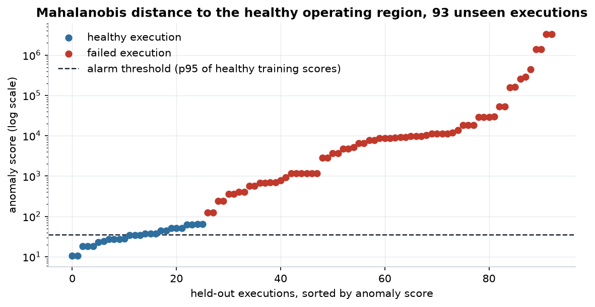
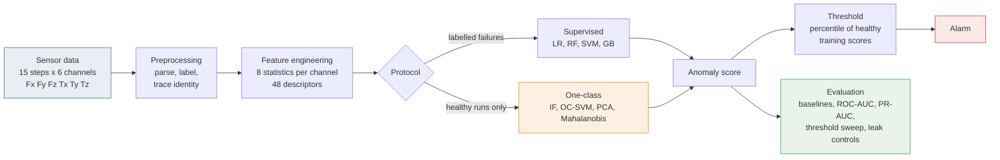
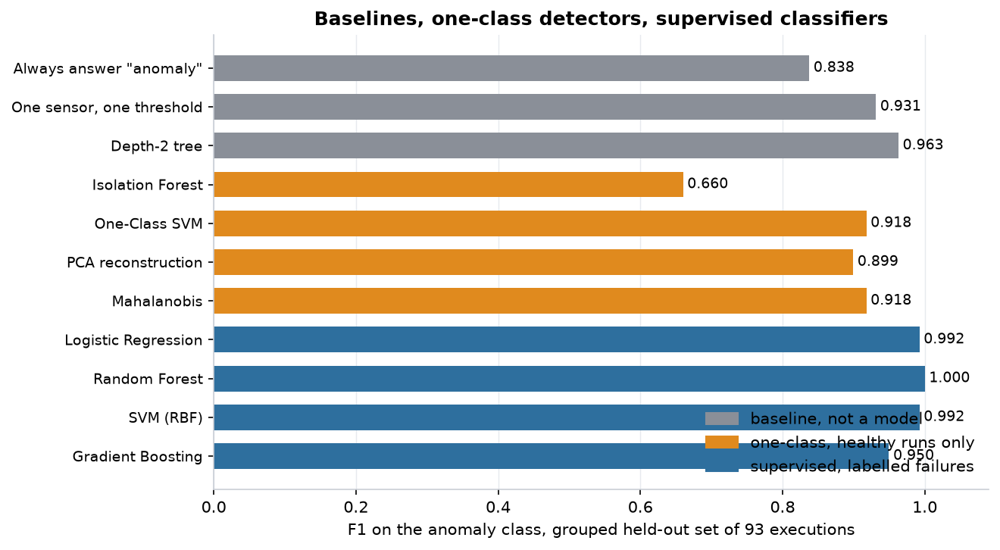
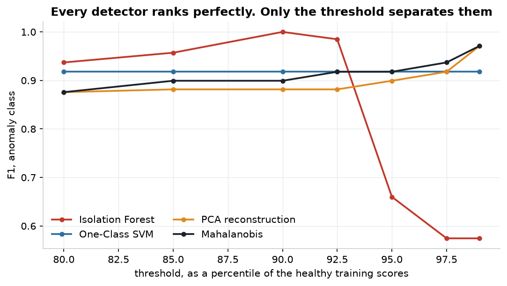
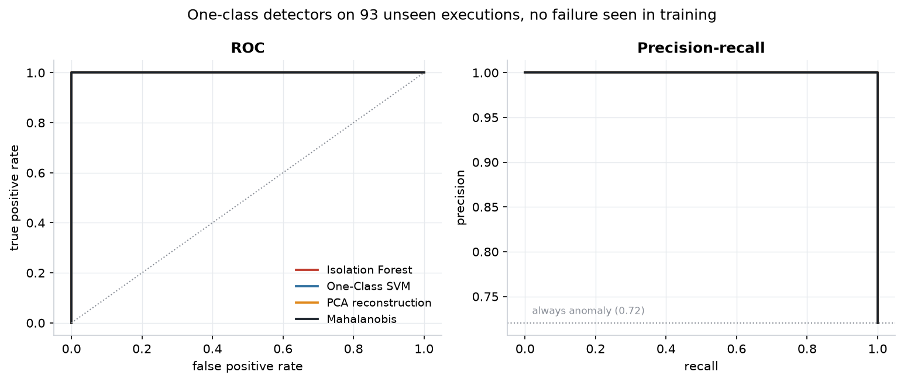
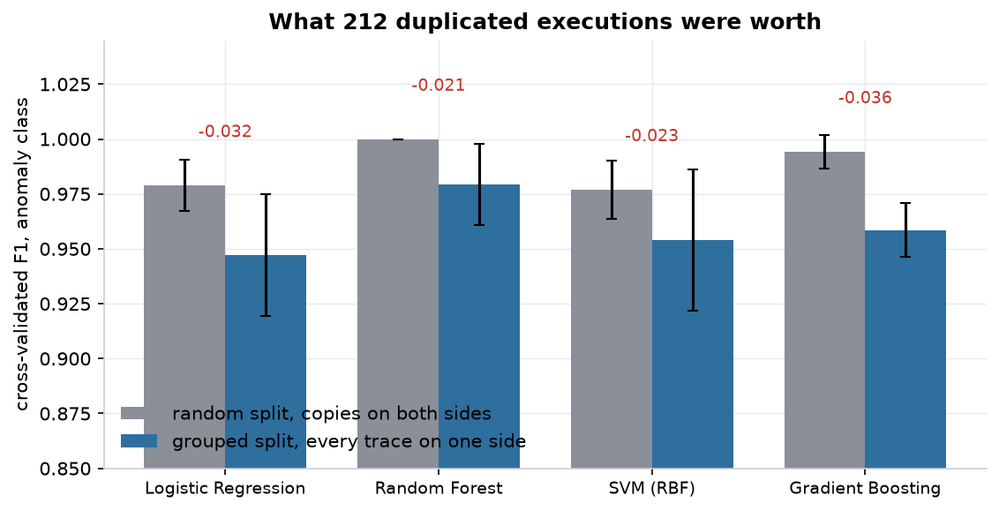
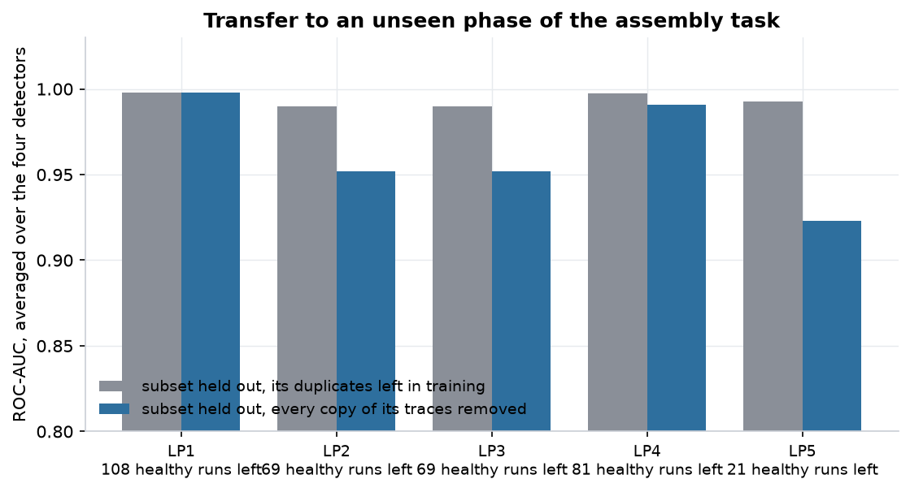
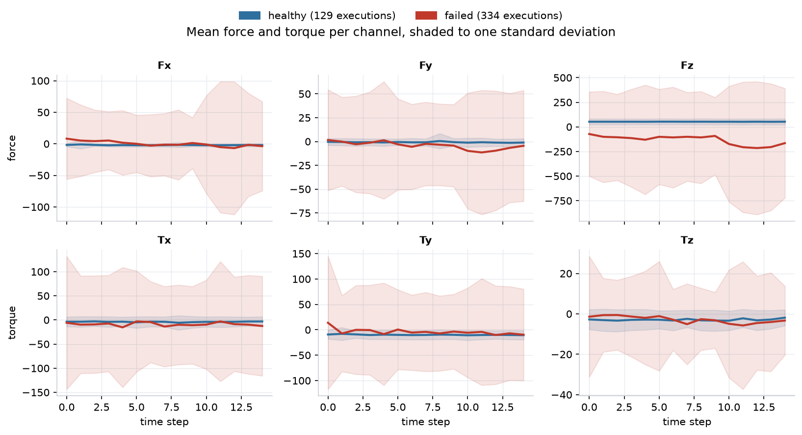
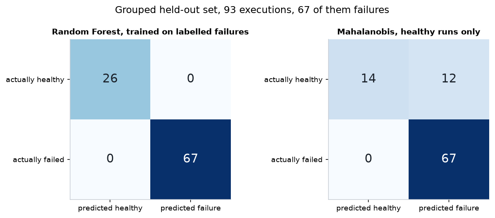

<div align="center">

# Robot Anomaly Detection

**An anomaly detection framework for robotic and industrial systems, built to detect abnormal operating behaviour from multivariate sensor data.**

Four supervised classifiers and four one-class detectors, on 463 executions of an
industrial manipulator recorded through six force and torque channels.
Every score is published beside a baseline, every leak is measured rather than
asserted, and continuous integration fails if any figure on this page moves.


[](https://github.com/Ilyess911/robot-anomaly-detection/actions/workflows/verify.yml)


<br />



<sub>A detector that has never seen a failure, scoring 93 executions it has never seen.
Every failure ranks above every healthy run. The alarm line is where the remaining error lives.</sub>

</div>

---

## Why this matters

A robot cell does not announce its faults. It produces a collision, an
obstruction or a lost part, and a wrist sensor records six numbers fifteen times
while it happens. Turning those numbers into a decision, stop the arm or let it
finish, is the elementary unit of industrial condition monitoring, and the same
shape of problem sits under predictive maintenance, equipment health monitoring
and most of what Industry 4.0 calls smart manufacturing.

The setting that makes it hard in practice is not the model. It is that a new
cell has months of healthy operation and no catalogue of the failures it has not
had yet. Half of this project therefore studies detectors that are fitted on
healthy data alone, which is what a real deployment can actually train on.

The other half studies whether the reported numbers mean anything. They mostly
did not, and finding out why is the contribution.

## Problem statement

> **How well can lightweight machine learning models detect abnormal operating
> behaviour in a robotic system from multivariate force and torque data, and how
> much of a reported score survives an honest evaluation protocol?**

Formally: given an execution as a matrix of 15 time steps by 6 sensor channels,
decide whether it is healthy or failed, under two regimes. With labelled failures
available, which is the supervised case. And with only healthy executions
available, which is the deployable one.

## System overview



## The promise, and its limits

| It does | It does not |
| --- | --- |
| **Publish a baseline next to every score**, because 0.96 means nothing on its own | Claim the models are good. Most of the performance is in the data |
| **Detect without labelled failures**, fitted on healthy runs alone | Run anywhere near a production line |
| **Measure two leaks rather than assert their absence**, in one pinned environment | Validate over time. Executions are shuffled, not ordered |
| **Reproduce every figure on this page by one command** | Generalise beyond one arm, one task, one recording session |

## Methods

**Features.** Eight statistics per sensor channel: mean, standard deviation,
minimum, maximum, range, skewness, kurtosis and the slope of a linear fit over
the fifteen steps. Six channels gives 48 descriptors. Raw samples were rejected
because 90 values on 463 executions overfits and produces names no maintenance
engineer can argue with. `Tz_std` is the variability of yaw torque; feature 74 is
nothing.

**Supervised models**, when labelled failures exist: logistic regression, random
forest, RBF SVM, gradient boosting. Each grid-searched under stratified
cross-validation with the scaler inside the pipeline, so it is refitted on the
training folds alone.

**One-class detectors**, fitted on healthy executions only, spanning the ways a
detector can be cheap:

| Detector | Idea | Why it is here |
| --- | --- | --- |
| Isolation Forest | random partitioning isolates outliers in few splits | no distance, no distributional assumption |
| One-Class SVM | a kernel boundary around the healthy region | the standard non-parametric answer |
| PCA reconstruction | project onto the healthy subspace, rebuild, measure the residual | this is the linear autoencoder |
| Mahalanobis distance | distance to the healthy mean under a shrunk covariance | the classical control chart, the one to beat |

A nonlinear autoencoder is deliberately absent. There are 103 healthy executions
in the training half and 48 features; a network wide enough to be called one
would carry more parameters than it has samples, and its reconstruction error
would describe its initialisation rather than the robot. PCA reconstruction error
is the linear case of the same idea and it is honest at this sample size.

**Baselines**, published beside every score: answer "failure" every time, the
best single sensor statistic at a single threshold, and a depth-2 decision tree.

## Experimental setup

| | |
| --- | --- |
| Dataset | UCI Robot Execution Failures, LP1 to LP5, redistributed unmodified |
| Executions | 463, of which 129 healthy and 334 failed (72.0% failures) |
| Signal | 15 time steps by 6 channels, so 90 raw values per execution |
| Features | 48 statistical descriptors |
| Split | 370 train, 93 test, stratified, **grouped by sensor trace** |
| Cross-validation | 5-fold stratified, grouped, scaler inside the pipeline |
| Seed | 42 everywhere, set in `configs/default.toml` |
| Environment | Python 3.14.6, scikit-learn 1.9.0, numpy 2.5.1, pinned in `requirements-lock.txt` |

Both splits compared below hold 370 training and 93 test executions at the same
class balance. The only variable between them is whether copies of a recording
are allowed on both sides.

## Results

### The problem is easier than any model suggests

The first three rows are not models.

| | F1 failure | Accuracy | Precision | Recall |
| --- | --- | --- | --- | --- |
| Answer "failure" every time | 0.838 | 0.720 | 0.720 | 1.000 |
| **One sensor, one threshold** (`Fx_range`) | **0.931** | 0.903 | 0.953 | 0.910 |
| A depth-2 tree, so three decisions | 0.963 | 0.946 | 0.956 | 0.970 |

One threshold on one force channel covers 93% of the way. Everything below buys
the remainder, and a results table that omits these three rows is misleading even
when every figure in it is correct.



### Supervised, on the grouped held-out set

| Model | F1 failure | Accuracy | ROC-AUC | PR-AUC | Grouped CV F1 |
| --- | --- | --- | --- | --- | --- |
| Logistic Regression | 0.993 | 0.989 | 0.993 | 0.998 | 0.947 ± 0.028 |
| **Random Forest** | **1.000** | 1.000 | 1.000 | 1.000 | 0.979 ± 0.019 |
| SVM (RBF) | 0.993 | 0.989 | 0.998 | 0.999 | 0.954 ± 0.032 |
| Gradient Boosting | 0.950 | 0.925 | 0.926 | 0.947 | 0.959 ± 0.012 |

Gradient boosting lands below the depth-2 tree on this fold. With 93 held-out
executions, a single reclassified sample moves accuracy by more than a point, so
the cross-validated column is the one to read.

### One-class, fitted on 103 healthy runs and nothing else

| Detector | ROC-AUC | PR-AUC | F1 at p95 | Precision | Recall | Best reachable F1 |
| --- | --- | --- | --- | --- | --- | --- |
| Isolation Forest | 1.000 | 1.000 | 0.660 | 1.000 | 0.493 | 1.000 |
| One-Class SVM | 1.000 | 1.000 | **0.918** | 0.848 | 1.000 | 1.000 |
| PCA reconstruction | 1.000 | 1.000 | 0.899 | 0.817 | 1.000 | 1.000 |
| Mahalanobis | 1.000 | 1.000 | **0.918** | 0.848 | 1.000 | 1.000 |

Read the first column and the third together. **All four rank every failure above
every healthy execution, and all four lose between 0.08 and 0.34 F1 to where the
threshold falls.** The discrimination problem is solved on this data. The
calibration problem is not, and calibration is the only part a deployment without
labels has to solve on its own.



Isolation Forest is the extreme case: 1.000 at the 90th percentile, 0.660 at the
95th. One-Class SVM is flat across the whole sweep. PCA and Mahalanobis improve
monotonically towards the 99th. Choosing the detector and choosing the threshold
rule are the same decision.



### The benchmark contains duplicates, and they made the scores perfect

463 rows hold **251 distinct sensor traces**. LP2 and LP3 annotate the same 47
recordings under two different fault taxonomies; LP4 and LP5 share 116 more.
Under the random split every published result on this dataset uses, including
this project's own earlier numbers, **64 of the 93 test executions have an exact
copy in the training half**.

| Cross-validated F1 | Random folds | Grouped folds | Cost |
| --- | --- | --- | --- |
| Logistic Regression | 0.979 ± 0.012 | 0.947 ± 0.028 | **-0.032** |
| Random Forest | **1.000 ± 0.000** | 0.979 ± 0.019 | **-0.021** |
| SVM (RBF) | 0.977 ± 0.013 | 0.954 ± 0.032 | **-0.023** |
| Gradient Boosting | 0.994 ± 0.008 | 0.959 ± 0.012 | **-0.036** |



The standard deviation of exactly zero was the tell. A model does not reach
identical perfection on five different folds of 463 samples unless the folds are
not independent. Full evidence in [`docs/data-quality-audit.md`](docs/data-quality-audit.md).

### Transfer to an unseen phase of the task

Hold out one phase, fit on the rest, and remove every copy of the held-out
traces. Mean ROC-AUC over the four detectors:

| Held out | Healthy runs left to fit on | Trace-disjoint | Duplicates left in |
| --- | --- | --- | --- |
| LP1 | 108 | 0.998 | 0.998 |
| LP2 | 69 | 0.952 | 0.990 |
| LP3 | 69 | 0.952 | 0.990 |
| LP4 | 81 | 0.991 | 0.998 |
| LP5 | 21 | **0.923** | 0.993 |



The naive protocol reports near-perfect transfer everywhere. The honest one does
not, and the hardest case leaves only 21 healthy executions to learn from.

### The standardisation leak, measured in the same environment

The original notebooks standardise before they split, so the scaler sees the test
half.

```python
X_scaled = scaler.fit_transform(X)                    # the whole dataset
X_train, X_test, y_train, y_test = train_test_split(X_scaled, ...)
```

| | Leaky | Clean | Cost |
| --- | --- | --- | --- |
| Logistic Regression | 1.000 | 0.977 | **-0.023** |
| Random Forest | 1.000 | 1.000 | 0.000 |
| SVM (RBF) | 0.977 | 0.977 | 0.000 |
| Gradient Boosting | 0.993 | 0.993 | 0.000 |

Zero on the tree models, which are invariant to scaling and could never have been
affected. On logistic regression the leak buys a fake perfect score.

An earlier version of this page got that number wrong, reporting -0.011 by
comparing notebook outputs from Python 3.9 against a script run on Python 3.14
with a five-year-newer scikit-learn. Two variables, one conclusion. Any leak
measurement is only meaningful inside one environment, which is why
`requirements-lock.txt` pins it.

### Why the shuffled-label control was not enough

The control is to destroy the signal and check that the model follows: refit on
permuted labels, five draws.

| Labels | CV F1 |
| --- | --- |
| Real | 0.993 |
| Shuffled | **0.760** |

Trained on noise, the model lands below the constant baseline of 0.838, which is
what a clean pipeline does. This control passed for a year while 46% of the
dataset was duplicated executions, and it was right to: a permutation breaks the
association a duplicate carries, so a sample leak collapses under it exactly like
a clean pipeline. **A leak control tests one leak.** Feature leakage, scaler
leakage and sample leakage are three different failures and each needs its own
check. All three now run on every commit.

## Signals





## Design decisions

**Statistical features instead of raw samples.** 90 raw values on 463 runs
invites overfitting and resists interpretation. Eight statistics per sensor cut
the space to 48 dimensions and produce names a maintenance engineer can argue
with.

**All five subsets merged, but grouped by trace.** LP1 to LP5 are phases of one
assembly task, holding between 47 and 164 executions. Kept apart, three of the
five are too small to split meaningfully. Merged naively, the duplicates leak.
Merged with a grouped split, both problems are answered.

**Binary target.** The 16 original labels include classes with 3 and 5 members. A
16-class model on 463 samples produces confident nonsense on the rare ones, and
the useful question on a line is binary anyway: stop the arm or not.

**One-class detectors see only healthy runs.** That mirrors deployment order. A
new cell has months of healthy operation and no catalogue of failures it has not
had yet.

**The threshold is a percentile of the healthy training scores.** It is the only
rule available without labelled failures. The best threshold an oracle could pick
is reported separately, and the gap between the two is the honest cost of not
having labels.

## Repository structure

```
src/
  data/          loader.py        parsing, label semantics, trace identity
  features/      statistical.py   48 descriptors from 90 raw readings
  models/        supervised.py    classifiers and their search grids
                 detectors.py     four one-class detectors, one contract
                 legacy.py        the notebooks' trainers, superseded
  evaluation/    metrics.py       named metrics, threshold analysis, controls
                 protocol.py      random and grouped splits, side by side
  visualization/ plots.py         exploratory figures
  config.py                       parameters, seeding, logging
  utils.py                        the notebooks' old import surface

scripts/  benchmark.py    baselines and supervised models, both protocols
          experiments.py  one-class, threshold sweep, transfer study
          figures.py      redraws every image on this page from reports/
          detect.py       inference CLI, scores a subset or a file
app/      streamlit_app.py   browser demo, move the threshold and watch
configs/  default.toml    every parameter that can move a published number
tests/    test_dataset.py test_protocol.py test_duplicates.py test_detectors.py
notebooks/ 01 exploration, 02 preprocessing, 03 supervised, 04 unsupervised, 05 evaluation
data/     lp1 to lp5, the UCI subsets, unmodified
reports/  benchmark.json, experiments.json, regenerated by CI and compared
assets/   every figure on this page
docs/     the audit, the research pitch, the application summary
```

### The documentation kit

| File | What it holds |
| --- | --- |
| [`docs/data-quality-audit.md`](docs/data-quality-audit.md) | Both data defects, the evidence, and why the existing control missed one |
| [`docs/research_pitch.md`](docs/research_pitch.md) | Motivation, methods, results, limits, and a 9 to 12 week extension |
| [`docs/application_summary.md`](docs/application_summary.md) | The project at three lengths, plus the open research questions |
| [`docs/engineering-rules.md`](docs/engineering-rules.md) | Engineering rules this repository does not negotiate |
| `reports/*.json` | The proof behind every number on this page |

## Quick start

```bash
git clone https://github.com/Ilyess911/robot-anomaly-detection.git
cd robot-anomaly-detection
make setup        # venv with the exact versions behind the published numbers
make verify       # lint, tests, both benchmarks
make reproduce    # every number and every figure on this page, from scratch
```

## Example usage

Score one phase of the task with a detector that has never seen it, or any of its
duplicated recordings:

```bash
python scripts/detect.py --subset LP1 --detector mahalanobis --top 5
```

```
 execution  anomaly_score  flagged  actual
        66     776261.248        1 failure
        60     628700.987        1 failure
        70     508568.792        1 failure
        83     366135.046        1 failure
        37     305859.507        1 failure

alarm threshold (p95 of healthy training scores): 35.708
flagged 87 of 88 executions
against the recorded labels: f1 0.870, precision 0.770, recall 1.000, roc-auc 1.000
```

In code:

```python
from src.data.loader import encode_labels, load_robot_data, trace_ids
from src.features.statistical import create_statistical_features, feature_matrix
from src.evaluation.protocol import grouped_split
from src.models.detectors import MahalanobisDetector

frame, _ = encode_labels(load_robot_data(), binary=True)
X, _ = feature_matrix(create_statistical_features(frame))
y = frame["label_encoded"].to_numpy()

split = grouped_split(X, y, trace_ids(frame))
detector = MahalanobisDetector(percentile=95.0).fit(split.X_train[split.y_train == 0])

scores = detector.anomaly_score(split.X_test)   # higher means more anomalous
alarms = detector.predict(split.X_test)         # 1 when above the calibrated threshold
```

Or in the browser:

```bash
pip install -r requirements-demo.txt
make demo
```

## Research perspective

**The question this project answers.** Lightweight one-class models detect
abnormal operating behaviour on this data essentially perfectly in ranking terms,
and imperfectly in operational terms, because the threshold has to be set without
labels. The gap between ROC-AUC 1.000 and F1 0.660 is not a modelling failure, it
is the calibration problem stated precisely.

**The question it raises.** How does one set that threshold on a machine that has
never failed? Extreme value theory on the healthy score tail and conformal
prediction both offer distribution-free guarantees on the false alarm rate, and
this dataset is a clean place to compare them because discrimination is already
saturated.

Extensions this work sets up, none of them implemented here:

- real-time edge deployment, and the latency, memory and energy each detector
  actually costs
- online detection with drift-adaptive thresholds
- remaining useful life estimation, which needs a dataset with chronology
- multi-sensor fusion beyond one wrist sensor
- fault diagnosis over the 16 original classes rather than the binary collapse
- digital twin residuals as an alternative anomaly score
- industrial IoT integration, where the constraint is the network rather than the
  model

## Industrial applications

The shape of this problem, multivariate sensor traces from a repeated operation
with abundant healthy history and scarce failure history, recurs across:

- **Avionics and aerospace maintenance**, where condition monitoring competes
  with scheduled intervals and a false alarm grounds an aircraft
- **Manufacturing systems**, where an undetected collision damages tooling and a
  spurious stop costs throughput
- **Industrial robotics**, where the wrist force and torque signal is already
  recorded and mostly unused
- **Rotating and reciprocating equipment**, where the same statistics over the
  same window shape apply to vibration rather than force

This project uses a public academic dataset. It contains no proprietary,
operational or employer data of any kind.

## Limitations

Read these before quoting any number above.

**The held-out set is 93 executions.** One reclassified sample moves accuracy by
more than a point. The cross-validated figures are more trustworthy than the
single split, and both are reported.

**The class balance is inverted relative to reality.** 72% failures here; a real
line sees the opposite, and precision on the rare class is exactly what would
degrade. This project does not measure the thing that would matter most.

**There is no temporal validation.** Executions are shuffled, not ordered. A real
deployment trains on the past and tests on the future, including sensor drift and
recalibration, none of which this dataset exposes.

**One robot, one task, one recording session.** The transfer study holds out one
phase of the same assembly task, which is the hardest question this dataset can
ask. It is not a transfer result across arms or cells.

**The time axis is collapsed before any model sees it.** No sequential model is
used and no claim about sequence modelling is made.

**Nothing is deployed.** No inference service, no latency measurement, no
monitoring.

**The notebooks still show the old numbers.** They ran before both fixes and have
not been re-executed, on purpose: rewriting them would erase the record of what
was wrong. Where they disagree with this page, this page is right.

## Future work

Ordered by what the results make most pressing, and detailed in
[`docs/research_pitch.md`](docs/research_pitch.md).

1. Label-free threshold calibration with a false alarm guarantee
2. Sequential models on the raw 15 by 6 tensor, tested rather than assumed better
3. Edge cost of each detector: latency, memory, energy
4. A benchmark with realistic imbalance and genuine chronology
5. Fault diagnosis and remaining useful life, where the industrial value sits

## What I take from it

That the labels and the rows deserve more suspicion than the model. Four
classifiers within two points of each other told me nothing. Twenty rows named
`ok` instead of `normal`, and 212 rows that were the same recordings twice,
changed every table on this page.

That a baseline is not a formality. The distance between 0.838 and 1.000 is the
whole contribution, and publishing the second without the first is the most
common way to be technically truthful and practically misleading.

That a control proves one thing. The shuffled-label test was correct, necessary,
and blind to the defect that mattered most.

## Author

**Ilyess Assadi**
Engineering student, Industry & Robotics, ESILV Paris
Avionics maintenance engineering apprentice, Air France Industries
TOEIC 945/990

Built with **Adel Bousri** as a machine learning course project at ESILV. The
original pipeline, modules and notebooks are joint work. The audit, the grouped
protocol, the one-class study, the tests and this page are later additions by
Ilyess Assadi.

## Contact

- GitHub: [@Ilyess911](https://github.com/Ilyess911)
- LinkedIn: *to be added*
- Email: *to be added*

## Citation

The dataset belongs to its authors and is redistributed here unmodified for
reproducibility. Please cite the
[UCI entry](https://archive.ics.uci.edu/dataset/138/robot+execution+failures),
donated by Luis Seabra Lopes and Luis M. Camarinha-Matos, rather than this
repository. `CITATION.cff` holds both.

## License

MIT for the code. See [LICENSE](LICENSE); the dataset is excluded and keeps its
own terms.

<div align="center">
<sub>Every number on this page comes from <code>reports/</code> and regenerates with <code>make reproduce</code>.<br/>
Continuous integration replays both benchmarks on every push and fails if any published figure moves.</sub>
</div>
