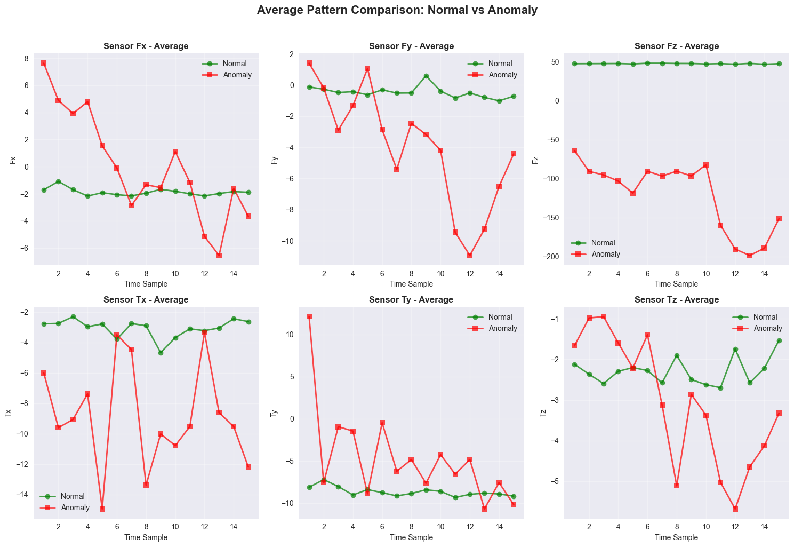

# Robot Anomaly Detection

Detecting collisions, obstructions and tool faults in industrial robot executions,
from six force and torque sensors sampled fifteen times per run.

An industrial robot cannot tell you it has hit something. Its force and torque sensors
can, and they react within milliseconds. This project turns 463 recorded executions
into a classifier that separates a healthy run from a failed one, and asks how much of
that separation is real once the evaluation is done honestly.



The signal is visible before any model touches it. On `Fz`, a normal run holds a flat
positive load while an anomalous one collapses to negative values. That gap is what the
models learn, and it is also why the results below need a baseline to be read at all.

<br>

## What is in here

Five notebooks that walk the full pipeline, from raw sensor traces to evaluated models.

A `src/` package holding the parts worth reusing: a parser for the dataset's unusual
format, a statistical feature builder, a model trainer with hyperparameter search, and
plotting helpers.

A `scripts/benchmark.py` that re-runs the model comparison under a stricter protocol
than the notebooks, because the notebooks have a data leak. It is described below,
along with what it changed and what it did not.

<br>

## The dataset

[UCI Robot Execution Failures](https://archive.ics.uci.edu/dataset/138/robot+execution+failures),
donated by Luis Seabra Lopes and Luis M. Camarinha-Matos.

Five subsets, one per phase of a robotic assembly task: approach to grasp, transfer,
positioning, approach to ungrasp, and motion with the part. Every execution is a small
time series: 6 sensors (`Fx`, `Fy`, `Fz`, `Tx`, `Ty`, `Tz`) by 15 samples, so 90 raw
values.

```
463 executions
 16 original labels, collapsed to normal against anomaly
334 anomalies, 129 normal runs
```

That last line is the one that matters. The dataset is 72 percent anomalies, which is
the opposite of what a production line looks like, and it inflates every score computed
on the positive class.

<br>

## Results

Statistical features (mean, standard deviation, min, max, range, skewness, kurtosis and
linear trend, per sensor: 48 features), an 80/20 stratified split, five-fold grid search
on the training half. Test set: 93 executions, 71 of them anomalous.

The first row is not a model. It is a constant answer, and it is the number every other
row has to beat.

| Supervised | F1 anomaly | Accuracy | Precision | Recall | ROC AUC | CV F1 |
|---|---|---|---|---|---|---|
| Always answer "anomaly" | 0.866 | 0.763 | 0.763 | 1.000 | | |
| Logistic Regression | 0.942 | 0.914 | 0.970 | 0.916 | 0.972 | 0.936 ± 0.017 |
| SVM (RBF) | 0.948 | 0.925 | 1.000 | 0.901 | 0.968 | 0.943 ± 0.020 |
| Gradient Boosting | 0.957 | 0.936 | 0.985 | 0.930 | 0.979 | 0.938 ± 0.012 |
| **Random Forest** | **0.964** | **0.946** | **0.985** | **0.944** | **0.980** | **0.941 ± 0.017** |

| Unsupervised, trained on 87 normal runs | F1 anomaly | Accuracy | Precision | Recall |
|---|---|---|---|---|
| Isolation Forest | 0.951 | 0.925 | 0.944 | 0.958 |
| One-Class SVM | 0.938 | 0.903 | 0.919 | 0.958 |

Random Forest wins, at 0.964 F1 against a 0.866 floor. Stated without the floor, 0.964
sounds like a solved problem. Stated with it, the models close about three quarters of
the distance between guessing and perfection, on 93 test samples, which is a respectable
result and a fragile one.

The two unsupervised detectors never see an anomaly during training. They are not
competitive with the supervised models, but they land within two points of them without
a single failure label, which is the regime an actual factory starts in.

Reproduce with `python scripts/benchmark.py --output reports/benchmark.json`.

<br>

## The leak, and what it was worth

The notebooks standardise before they split:

```python
scaler = StandardScaler()
X_scaled = scaler.fit_transform(X)                      # sees the whole dataset
X_train, X_test, y_train, y_test = train_test_split(X_scaled, ...)
```

The scaler learns the mean and variance of the test set before being evaluated on it.
This is a textbook leak and it is the first thing anyone should look for in a notebook.

`scripts/benchmark.py` puts the scaler inside a `Pipeline`, so it is refitted on the
training folds alone at every turn. The interesting part is the size of the correction:

| | Notebook | Leak-free | Delta |
|---|---|---|---|
| Random Forest, accuracy | 0.946 | 0.946 | 0.000 |
| Logistic Regression, accuracy | 0.925 | 0.914 | -0.011 |
| Logistic Regression, ROC AUC | 0.977 | 0.972 | -0.005 |

Close to nothing, and for a reason worth stating: Random Forest and Gradient Boosting
are invariant to feature scaling, so the leak could never have reached them. Only the
two distance-based models could move, and on 463 samples the difference between a scaler
fitted on 463 rows and one fitted on 370 is small.

So the leak was real, and immaterial here. Both halves of that sentence matter. Finding
it is not impressive if you cannot say what it cost, and "the numbers were inflated"
would have been a more dramatic claim than the evidence supports.

Two other things the benchmark fixes, which mattered more:

**The F1 changed meaning between notebooks.** Notebook 03 prints a weighted average,
notebook 05 prints the positive class, and notebook 04 prints both for the same model
in the same cell. The apparent superiority of the unsupervised methods, 0.972 against
0.947, was two different metrics next to each other.

**The two families were scored on different test sets**, 93 samples for supervised and
376 for unsupervised. The unsupervised set was larger and even more anomaly-heavy, which
lifted its F1 for free. They now share one test set, and the ranking reverses.

<br>

## Decisions

**Statistical features rather than raw samples.** 90 raw values per execution, on 463
executions, is a shape that invites overfitting and resists interpretation. Eight
statistics per sensor cut the space to 48 dimensions and, more importantly, produce
features a maintenance engineer can argue with: `Tz_std` is the variability of the yaw
torque, not "feature 74".

**All five subsets merged.** LP1 to LP5 are different phases of the same task, with
between 47 and 164 executions each. Kept apart, three of the five are too small to split
meaningfully. Merged, the model learns a notion of anomaly that spans phases. The cost
is stated in the limits: a per-phase model would very likely do better on its own phase.

**Binary target.** The 16 original labels include classes with 3 and 5 members. Training
a 16-class model on 463 samples would produce confident nonsense on the rare ones. The
useful question on a line is also binary: stop the arm, or do not.

**Unsupervised models trained on normal runs only.** This mirrors the real deployment
order. A new cell has months of healthy operation and no catalogue of the failures it
has not had yet.

<br>

## Limits

The honest reading of this project, in the order a reviewer would raise them.

**The test set is 93 executions.** One reclassified sample moves accuracy by a full
point. Every number above should be read with that grain of salt, and the cross-validated
scores (0.941 ± 0.017 for Random Forest) are more trustworthy than the single test split.

**The class balance is inverted relative to reality.** 72 percent anomalies. A real line
sees the opposite, and precision on the rare class is exactly what would degrade. This
project does not measure the thing that would matter most in production.

**There is no temporal validation.** Executions are shuffled at random. A deployment
would need to train on the past and test on the future, including sensor drift and
recalibration, none of which this dataset exposes.

**The dataset is old and single-source.** One robot, one assembly task, recorded in a
research context. Nothing here demonstrates transfer to another arm or another cell.

**Nothing is deployed.** There is no inference service, no latency measurement, no
monitoring. The models are pickles on disk, and the code that produced them is the only
thing that has been run.

**The notebooks keep their original numbers.** They were not re-executed after the
benchmark was written, so a reader who compares them cell by cell will find the small
discrepancies documented above rather than a silent rewrite of history.

<br>

## What this project taught me

That evaluation protocol is the whole game on a small dataset. The four supervised
models are within two points of each other, which is inside the noise of a 93-sample
test set. Choosing between them on that basis would be superstition, and Random Forest
is preferred here for its stability across folds and its readable feature importances,
not for winning by 0.007.

That a baseline is not a formality. The gap between 0.866 and 0.964 is the entire
contribution, and it is much less impressive than 0.964 alone. Publishing the second
number without the first is the most common way to be technically truthful and
practically misleading.

That torque carries more information than force here, which the models found and the
first figure shows: `Tx` and `Ty` separate the two populations more cleanly than `Fx`
and `Fy` do. Physical interpretation is not decoration on top of a model, it is how you
tell a real pattern from a fitted artefact.

<br>

## Roadmap

Nothing here is committed work. It is what a next pass would address, in order of value.

- Per-phase models, one per LP subset, compared against the merged model
- Nested cross-validation, so hyperparameter search stops borrowing from the test set
- Precision-recall curves in place of ROC, which flatters imbalanced problems
- A small inference entry point taking a raw execution and returning a decision
- Re-execution of the notebooks under the leak-free protocol, so the two agree

<br>

## Running it

Requires Python 3.9 or later.

```bash
git clone https://github.com/Ilyess911/robot-anomaly-detection.git
cd robot-anomaly-detection
./start.sh
```

`start.sh` creates the virtual environment, installs the dependencies, registers a
Jupyter kernel named `Python (robot-anomaly)` and opens the notebooks. Run them in order,
01 through 05.

To reproduce the benchmark table without opening a notebook:

```bash
python -m venv .venv
./.venv/bin/pip install -r requirements.txt
./.venv/bin/python scripts/benchmark.py
```

It takes a few minutes, most of it in the SVM grid search.

<br>

## Structure

```
notebooks/     01 exploration, 02 preprocessing, 03 supervised,
               04 unsupervised, 05 evaluation
src/           utils.py    dataset parsing, features, plots, metrics
               models.py   trainers with grid search, save and load
scripts/       benchmark.py        leak-free model comparison
               scrub_notebooks.py  strips machine paths and warning noise
data/          lp1 to lp5, the UCI subsets, unmodified
models/        trained estimators, one pickle per model
reports/       benchmark.json, regenerated by the script
docs/          figures used by this README
```

<br>

## Credits

Built with Adel Bousri as a machine learning course project at ESILV. The pipeline, the
modules and the notebooks are joint work. The audit, the benchmark and this README are
later additions by Ilyess Assadi.

The dataset belongs to its authors and is redistributed here unmodified for
reproducibility. Please cite the UCI entry rather than this repository if you use it.

## License

MIT. See [LICENSE](LICENSE).
